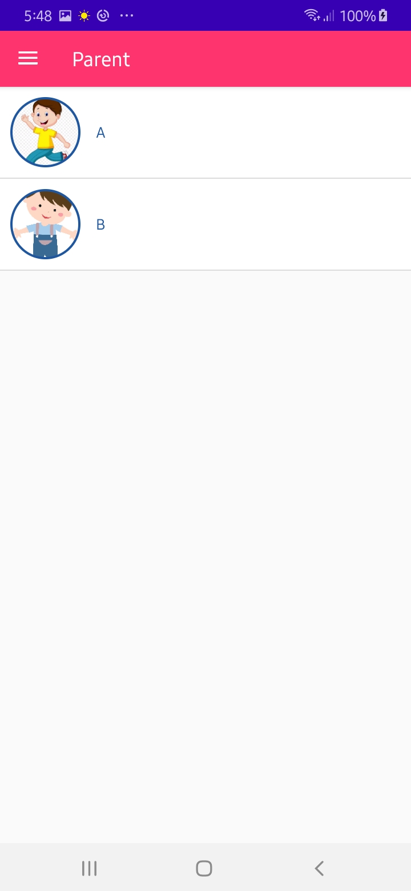
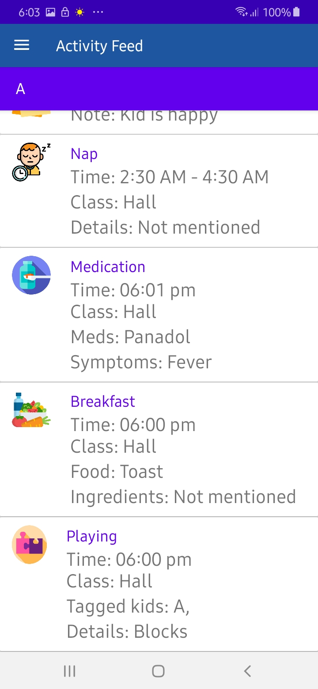

# ShiningStar
 
<h2>About</h2>

Application that integrates requirements of childcare. Parents wants to know about their children while at work, the application manage childcare and share information of child with parents. It provides a platform for communication between parents and children through staff. Parent adds child and share code of child with staff. Staff add children in rooms using code and give information about child activities to parents.

<h2>Preview</h2>

 
  
  
  
  
  
  
  
  
  
  
  
  
  
  
  
  
  
  
  
  
  
  
  
  
  

